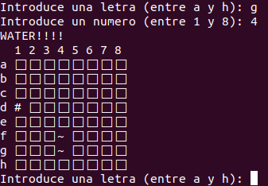

# Battleships

Implementación en python 3 del juego hundir la flota (Battleships).

# Configuración

Se trata de una versión muy sencilla sin ningún tipo de configuración.
Solo existe un tablero con los barcos que está hardcoded (escrito como variable en el código). Cuando el juego se inicia se muestra el tablero y se va indicando que fila y columna se quiere disparar.
Cuando no queden barcos sin hundir se acaba el juego.

# Ejecución

Solo existe un archivo python que tiene todo el código y que está disponible en la carpeta src.
Para ejecutarlo desde la carpeta de battleships habría que poner lo siguiente:

```bash
   $ python3 src/main.py
```


