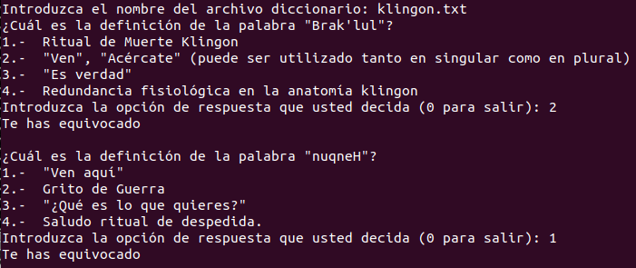
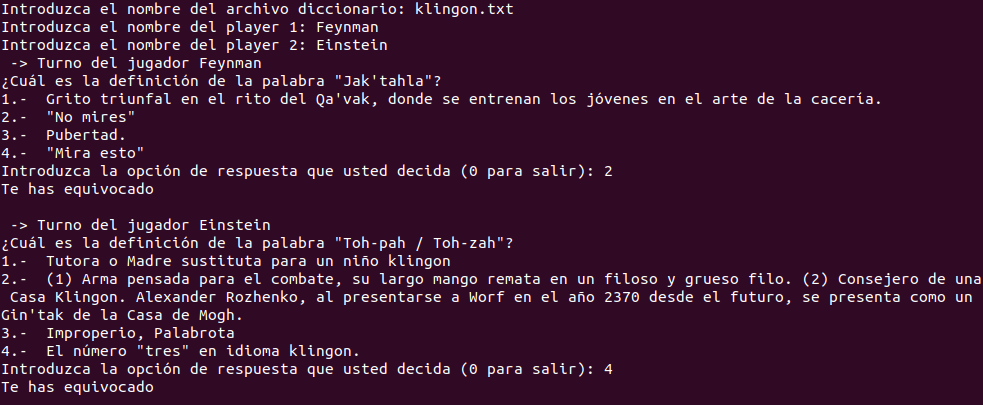

# Dictionary

Implementación en python 3 de una adaptación del juego del diccionario.

# Configuración

Se trata de una versión muy sencilla sin ningún tipo de configuración.

# Ejecución

Solo existe un archivo python que tiene todo el código y que está disponible en la carpeta src.
Para ejecutarlo desde la carpeta de battleships habría que poner lo siguiente:

```bash
   $ python3 src/main.py
```

El juego pide un nombre de archivo a cargar donde se encontrarán las palabras del diccionario.
En el archivo del diccionario habrá una entrada por linea donde la primera palabra será la palabra del diccionario, seguido de dos puntos (':') y después la definición.
En cada turno se mostrará una palabra y cuatro definiciones. Una definición será la correcta y las otras tres serán sacadas de otras palabras del diccionario.
Si aciertas con la definición correcta tendrás un acierto más. Si te equivocas un error más.




# Version dos jugadores

Se ha incluido una version para dos jugadores. Cada jugador introducirá su nombre al principio del juego. Los jugadores irán alternando los turnos mientras dure la partida. Al terminar se mostrará un resumen de las respuestas acertadas y erroneas de cada jugador.


