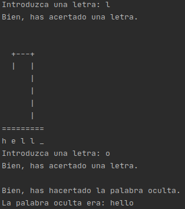

# Battleships

Implementación en python 3 del juego ahorcado (Hangman).

# Configuración

Se trata de una versión muy sencilla sin ningún tipo de configuración.

# Ejecución

Solo existe un archivo python que tiene todo el código y que está disponible en la carpeta src.
Para ejecutarlo desde la carpeta de battleships habría que poner lo siguiente:

```bash
   $ python3 src/main.py
```

El juego pide una palabra que será la palabra a adivinar.
Después se muestran los huecos y hay que ir poniendo una letra en cada turno.
Si la letra existe se mostrará en la palabra oculta y si no existe se añadirá una parte del cuerpo de la persona.
Cuando se acierte la palabra oculta o no queden más intentos el juego habrá terminado.


